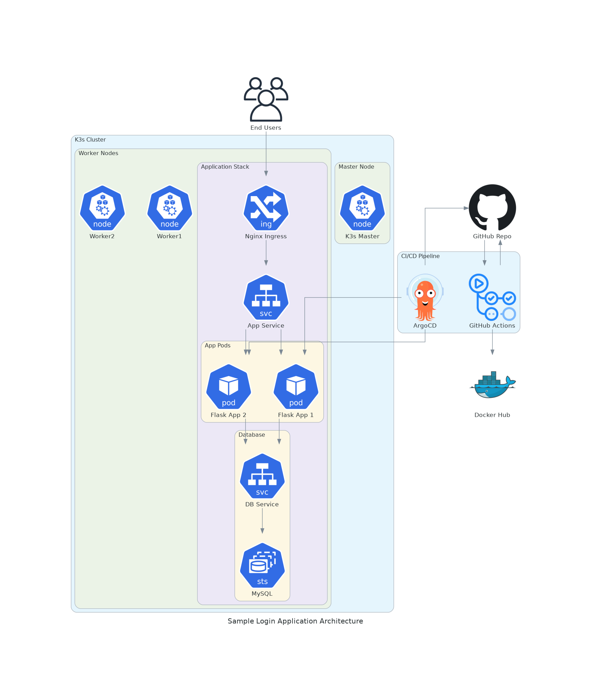

# Modern Login System

A modern, secure, and containerized login system built with Flask, featuring Kubernetes deployment and GitOps practices.

## Architecture


## Features

- 🔐 Secure Authentication
  - Password hashing
  - CSRF protection
  - Session management
  - Password history tracking

- ✉️ Email Features
  - Email verification
  - Password reset via email
  - Configurable email templates

- 👤 User Management
  - Profile customization
  - Avatar upload
  - Profile completion tracking

- 🛡️ Security Features
  - SQL injection prevention
  - XSS protection
  - Rate limiting
  - Session timeout

- 🚀 DevOps Features
  - Containerized application
  - Kubernetes deployment
  - GitOps with ArgoCD
  - CI/CD with GitHub Actions
  - Helm charts for deployment
  - High availability setup
  - Health monitoring

## Tech Stack

### Application
- Backend: Python/Flask
- Database: MySQL
- Frontend: HTML5, CSS3
- Security: Flask-WTF, Werkzeug

### Infrastructure
- Container Runtime: Docker
- Orchestration: Kubernetes (K3s)
- CI/CD: GitHub Actions
- GitOps: ArgoCD
- Package Manager: Helm
- Ingress: Nginx

## Local Development

1. Clone the repository
```bash
git clone https://github.com/0xsaju/sample-login.git
cd sample-login
```

2. Create virtual environment
```bash
python -m venv .venv
source .venv/bin/activate
```

3. Install dependencies
```bash
pip install -r requirements.txt
```

4. Set up environment variables
```bash
cp .env.example .env
# Edit .env with your configurations
```

5. Run locally
```bash
flask run
```

## Production Deployment

Please refer to [deployment.md](deployment.md) for detailed deployment instructions.

### Quick Start
```bash
# Install required tools
curl -sfL https://get.k3s.io | sh -
kubectl apply -f https://raw.githubusercontent.com/argoproj/argo-cd/stable/manifests/install.yaml

# Deploy application
kubectl create namespace sample-login
kubectl apply -f k8s/argocd/application.yaml
```

## Project Structure

```
sample-login/
├── architecture/          # Architecture diagrams and system design
│   └── system_diagram.py # System architecture generator
├── helm/                 # Helm charts for Kubernetes deployment
│   ├── templates/       # Kubernetes manifests
│   ├── Chart.yaml      # Helm chart definition
│   ├── values.yaml     # Default configuration
│   └── values-prod.yaml# Production configuration
├── k8s/                 # Kubernetes configurations
│   └── argocd/         # ArgoCD application manifests
├── .github/             # GitHub configurations
│   └── workflows/      # CI/CD pipeline definitions
├── static/             # Static assets
│   └── uploads/       # User uploaded files
├── templates/          # HTML templates
├── app.py             # Main application file
├── Dockerfile         # Container definition
├── docker-entrypoint.sh # Container entrypoint
├── requirements.txt   # Python dependencies
└── deployment.md      # Deployment documentation
```

## Contributing

1. Fork the repository
2. Create your feature branch
3. Commit your changes
4. Push to the branch
5. Open a pull request

See [CONTRIBUTING.md](CONTRIBUTING.md) for detailed guidelines.

## Production Readiness

- ✅ Container security scanning
- ✅ Automated testing
- ✅ High availability setup
- ✅ Health monitoring
- ✅ Resource management
- ✅ Secrets management
- ✅ Database backups
- ✅ Rolling updates

## Author

[github.com/0xsaju](https://github.com/0xsaju)

## License

This project is licensed under the MIT License - see the [LICENSE](LICENSE) file for details
