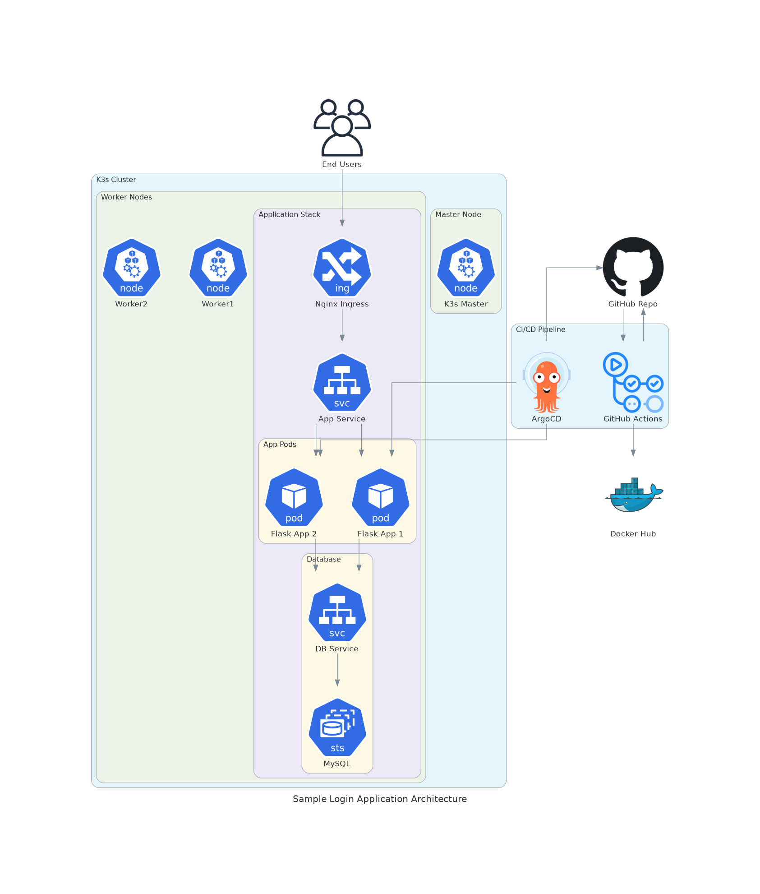

# Sample Login Application Deployment Guide

## System Architecture


## Prerequisites

- Docker (20.10+)
- Kubernetes cluster (K3s recommended)
- kubectl CLI tool
- Helm v3
- Git
- GitHub account with repository access
- Docker Hub account
- ArgoCD installed on the cluster

## Step 1: Clone Repository

```bash
# Clone the repository
git clone https://github.com/0xsaju/sample-login.git
cd sample-login

# If you're using a specific branch
git checkout dev_ci_cd_v1
```

## Step 2: Environment Setup

### 2.1 Configure GitHub Secrets
Add the following secrets to your GitHub repository:
```bash
DOCKER_HUB_USERNAME=your-username
DOCKER_HUB_TOKEN=your-token
```

### 2.2 Install Required Tools
```bash
# Install kubectl
curl -LO "https://dl.k8s.io/release/$(curl -L -s https://dl.k8s.io/release/stable.txt)/bin/linux/amd64/kubectl"
sudo install -o root -g root -m 0755 kubectl /usr/local/bin/kubectl

# Install Helm
curl https://raw.githubusercontent.com/helm/helm/main/scripts/get-helm-3 | bash

# Install K3s (if not using another Kubernetes cluster)
curl -sfL https://get.k3s.io | sh -
```

## Step 3: Cluster Preparation

### 3.1 Install ArgoCD
```bash
kubectl create namespace argocd
kubectl apply -n argocd -f https://raw.githubusercontent.com/argoproj/argo-cd/stable/manifests/install.yaml
```

### 3.2 Install Ingress Controller
```bash
helm repo add ingress-nginx https://kubernetes.github.io/ingress-nginx
helm install ingress-nginx ingress-nginx/ingress-nginx
```

### 3.3 Create Namespace
```bash
kubectl create namespace sample-login
```

## Step 4: ArgoCD Setup

### 4.1 Access ArgoCD UI
```bash
# Get ArgoCD admin password
kubectl -n argocd get secret argocd-initial-admin-secret -o jsonpath="{.data.password}" | base64 -d

# Port forward ArgoCD UI
kubectl port-forward svc/argocd-server -n argocd 8080:443
```

### 4.2 Configure ArgoCD Application
```bash
kubectl apply -f k8s/argocd/application.yaml
```

## Step 5: Database Initialization

### 5.1 Wait for MySQL StatefulSet
```bash
kubectl -n sample-login wait --for=condition=ready pod -l app=sample-login-mysql
```

### 5.2 Initialize Database (if needed)
```bash
# Port forward MySQL service
kubectl -n sample-login port-forward svc/sample-login-mysql 3306:3306

# Run database migrations
kubectl -n sample-login exec -it deploy/sample-login -- flask db upgrade
```

## Step 6: Verify Deployment

### 6.1 Check Application Status
```bash
kubectl -n sample-login get pods,svc,ingress
```

### 6.2 Access Application
```bash
# Get Ingress IP/Hostname
export INGRESS_HOST=$(kubectl -n sample-login get ingress sample-login -o jsonpath='{.status.loadBalancer.ingress[0].ip}')
echo "Access application at: http://$INGRESS_HOST"
```

## Step 7: Monitoring and Maintenance

### 7.1 View Application Logs
```bash
kubectl -n sample-login logs -l app=sample-login -f
```

### 7.2 Check Resource Usage
```bash
kubectl -n sample-login top pods
```

### 7.3 Scale Application
```bash
kubectl -n sample-login scale deployment sample-login --replicas=3
```

## Troubleshooting

### Common Issues and Solutions

1. **Pod Startup Issues**
   ```bash
   kubectl -n sample-login describe pod <pod-name>
   ```

2. **Database Connection Issues**
   ```bash
   kubectl -n sample-login exec -it <pod-name> -- flask db-check
   ```

3. **Storage Issues**
   ```bash
   kubectl -n sample-login get pvc,pv
   ```

### Health Checks
```bash
# Check application health
curl http://$INGRESS_HOST/health

# Check MySQL connection
kubectl -n sample-login exec -it <pod-name> -- mysqladmin ping -h sample-login-mysql
```

## Backup and Restore

### Database Backup
```bash
kubectl -n sample-login exec -it sample-login-mysql-0 -- \
  mysqldump -u root -p$MYSQL_ROOT_PASSWORD sample_login > backup.sql
```

### Database Restore
```bash
kubectl -n sample-login exec -it sample-login-mysql-0 -- \
  mysql -u root -p$MYSQL_ROOT_PASSWORD sample_login < backup.sql
```

## Security Considerations

1. Regularly update container images
2. Monitor security scan reports from CI pipeline
3. Keep Kubernetes and ArgoCD up to date
4. Rotate MySQL passwords periodically
5. Review pod security policies

## Monitoring and Alerts

Consider setting up:
- Prometheus for metrics
- Grafana for visualization
- AlertManager for notifications

## Support and Resources

- [GitHub Repository](https://github.com/0xsaju/sample-login)
- [Docker Hub Repository](https://hub.docker.com/r/0xsaju/sample-login-app)
- [ArgoCD Documentation](https://argo-cd.readthedocs.io/)
- [Kubernetes Documentation](https://kubernetes.io/docs/)
